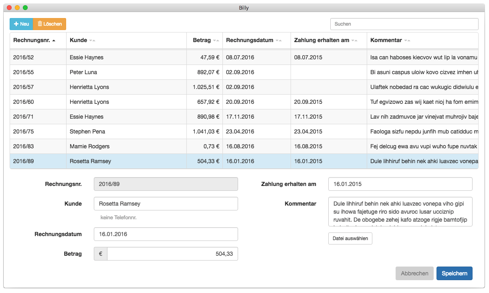

# Billy


**Screenshot:** 

## Setup

```bash
npm install
npm run setup
npm start
```

### Watch
To reload the application on code changes, start the app with `npm start` and perform a `npm run watch` in a new console tab

### Dev tools
To use the following dev tools open the browser console in the open app and install every extension manually (this needs to be done once only)

* React dev tools: `require('electron-react-devtools').install()`
* Electron devtron: `require('devtron').install()`

## Continuous Integration
* tests are run on every git push by [Circle CI](https://circleci.com/gh/haimich/billy)
* app files for Mac and Linux are built by [Travis CI](https://travis-ci.org/haimich/billy)
* app files for Windows are built by [Appveyor](https://ci.appveyor.com/project/haimich/billy)

## Releasing
### Gihub
* see https://help.github.com/articles/creating-releases/
* if you want to link issues, just add a section in the description - example:

```markdown
### Fixed issues
https://github.com/haimich/billy/issues/120
```

* increase the version in the package.json

### Electron
* see https://www.electron.build/
* many settings are made in the package.json
* after pushing any change in the master branch Travis will automatically create releases for Linux and Mac and push them to Github
* AppVeyor will do the same for the Windows release
* when you're done edit the release and click on "Publish release"
* this will automatically create a tag from the current master branch